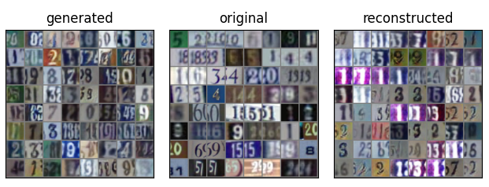

# UBC-OCEAN

This repository was developped for a kaggle competition ["UBC-OCEAN"](https://www.kaggle.com/competitions/UBC-OCEAN)

The difficulty of this competition comes from the size of whole slide images (WSI) which are typically gigapixel.

Neural image compression method ([Tellez *et al.*, 2020](https://arxiv.org/abs/1811.02840)) is employed to compress WSI to a much smaller feature space followed by a typical CNN to classify cancer subtype.

Following Tellez *et al.* (2020), Bidirectional GAN ([Donahue *et al.*, 2017](https://arxiv.org/abs/1605.09782)) is used to compress WSI.

Network architecture and training procedure are based on BigGAN ([Brock *et al.*, 2018](https://arxiv.org/abs/1809.11096)) with some modifications. Encoder and generator employ self-attention layer ([Zhang *et al.* 2018](https://arxiv.org/abs/1805.08318)) while only discriminator are normalized by spectral normalization ([Miyato *et al.*, 2018](https://arxiv.org/abs/1802.05957)).
Training procedure follows TTUR ([Heusel *et al.*, 2017](https://arxiv.org/abs/1706.08500)) discriminator is updated twice per generator/encoder update with twice as large learning rate.

# Preliminary results

### BiGAN on SVHN
* Small encoder, generator and discriminators trained for 120 epochs
* The reconstructed images are corresponding to the original images (although some of them don't seem like so)

