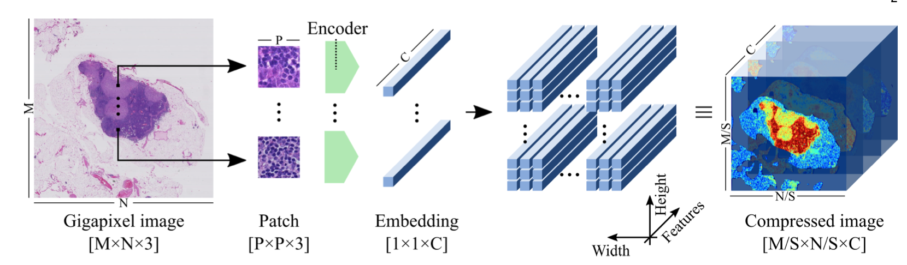
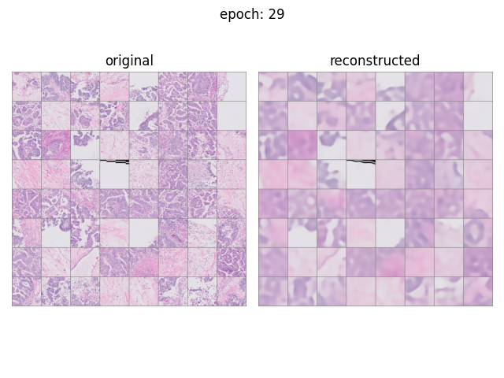
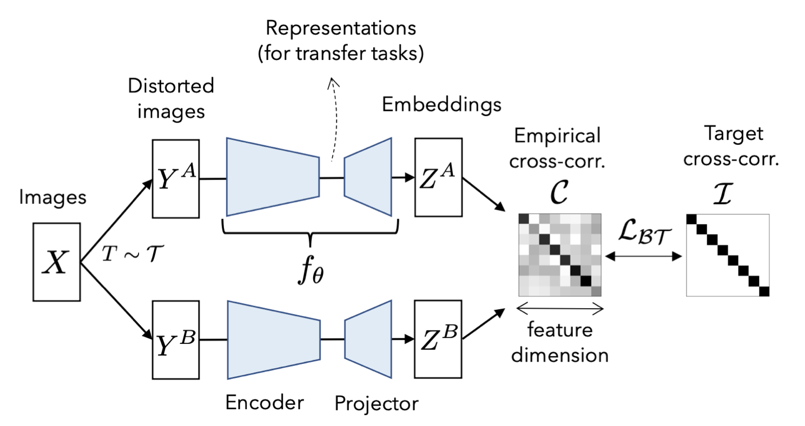
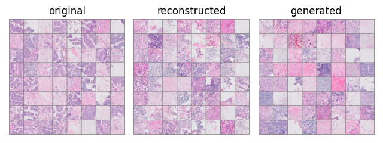
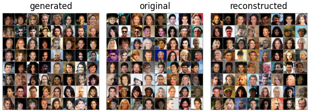
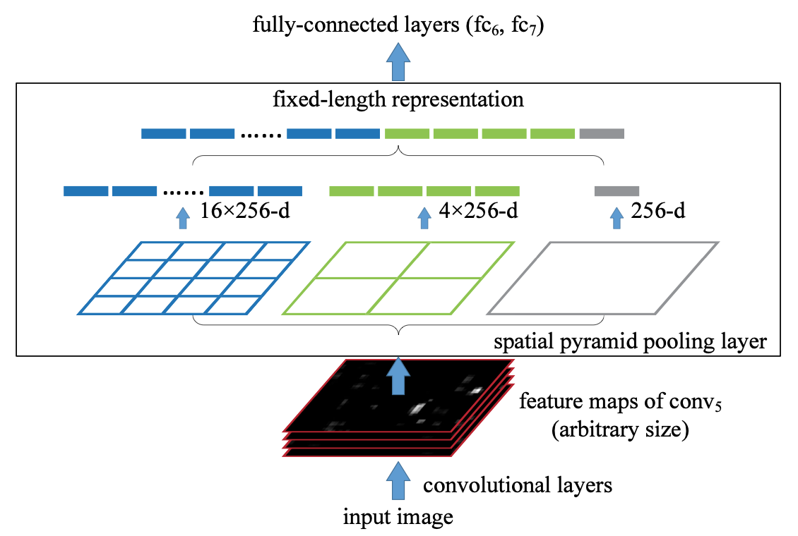

# UBC-OCEAN

This repository was developed for a kaggle competition [UBC-OCEAN](https://www.kaggle.com/competitions/UBC-OCEAN). The difficulty of this competition comes from the size of whole slide images (WSI) which are typically gigapixel.

[Tellez et al., (2020)](https://arxiv.org/abs/1811.02840) proposed neural image compression method to project WSI patches into a much smaller feature space followed by a typical CNN to classify cancer subtype given the compressed image.

## Encoders
Three methods of encoders are compared in my experiments.

### Variational Auto Encoder (VAE)
A vanilla VAE was trained on images of 128x128 pixels.

### Contrastive Learning (CL)
BarlowTwins ([Zbontar et al., (2021)](https://arxiv.org/abs/2103.03230)) is selected as a framework of contrastive learning.  
BarlowTwins is trained by making the cross-correlation matrix between the embeddings of two different view of images as close to the identity matrix as possible.

### Bidirectional Generative Adversarial Network (BiGAN)
Network architecture and training procedure are based on BiGAN ([Donahue *et al.*, (2016)](https://arxiv.org/abs/1605.09782)) with some modifications. Operations in the discriminator are normalized by spectral normalization ([Miyato *et al.*, (2018)](https://arxiv.org/abs/1802.05957)).
Training procedure follows TTUR ([Heusel *et al.*, (2017)](https://arxiv.org/abs/1706.08500)) discriminator is updated twice per generator/encoder update with twice as large learning rate.

#### UBCO dataset
* Trained for 150 epochs with batch size
* Reconstructed images correspond to the original images

#### Preliminary results on celebA dataset
* Trained for 90 epochs with batch size 128

## CNN
To handle different image size, I employed Spatial Pyramid Pooling ([He et al., (2014)](https://arxiv.org/abs/1406.4729v4)).
A concatenation of 1x1 max pooling (equivalent to global max pooling), 2x2 max pooling and 4x4 max pooling is used in my experiment.

Backbone of the CNN follows ConvNext ([Liu et al., (2022)](https://arxiv.org/abs/2201.03545)) architecture.

## Results
There are 5 cancer subtypes in the training data: CC, EC, HGSC, LGSC, MC. Validation set is constructed by taking one fold of StratifiedKFold splits of the training set.

Test data contains a sixth ***other*** class for rare cancer subtypes, which is not available in the training data. I did not predict other class, therefore the test balanced accuracy has 17% penalty.

Besides *other* class, majority (~55%) of the test set are 40x tissue microarray (TMA) whereas majority of the training set (95%) are 20x whole slide images (WSI). In addition, images in the test set are collected from different hospitals, thus quality of slides and staining techniques can be different. Those factors contribute to the discrepancy between the validation score and test score.

| encoder | validation balanced accuracy | test balanced accuracy |
| - | - | - |
| VAE | [0.50](https://wandb.ai/emiz6413/UBC-OCEAN/runs/3w259sgf?workspace=user-emiz6413) | 0.24 |
| BarlowTwins | [0.56](https://wandb.ai/emiz6413/UBC-OCEAN/runs/12yzo01v?workspace=user-emiz6413) | 0.18 |
| BiGAN | [0.71](https://wandb.ai/emiz6413/UBC-OCEAN/runs/2n7me2sl?workspace=user-emiz6413) | 0.21 |
