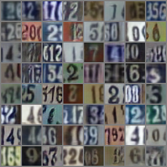
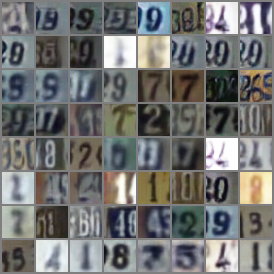

# UBC-OCEAN

This repository was developped for a kaggle competition ["UBC-OCEAN"](https://www.kaggle.com/competitions/UBC-OCEAN). The difficulty of this competition comes from the size of whole slide images (WSI) which are typically gigapixel.

[Tellez et al., 2020](https://arxiv.org/abs/1811.02840) proposed neural image compression method to project WSI patches into a much smaller feature space followed by a typical CNN to classify cancer subtype given the concatenated features.

Three methods of encoders are compared in my experiments.

### Variational Auto Encoder (VAE)

### Contrastive Learning (CL)

### Bidirectional Generative Adversarial Network (BiGAN)
Network architecture and training procedure are based on BigGAN ([Brock *et al.*, 2018](https://arxiv.org/abs/1809.11096)) with some modifications. Encoder and generator employ self-attention layer ([Zhang *et al.* 2018](https://arxiv.org/abs/1805.08318)) while only discriminator are normalized by spectral normalization ([Miyato *et al.*, 2018](https://arxiv.org/abs/1802.05957)).
Training procedure follows TTUR ([Heusel *et al.*, 2017](https://arxiv.org/abs/1706.08500)) discriminator is updated twice per generator/encoder update with twice as large learning rate.

# Preliminary results

### BiGAN on SVHN

| generated | reconstructed |
| - | - |
|  |  |
